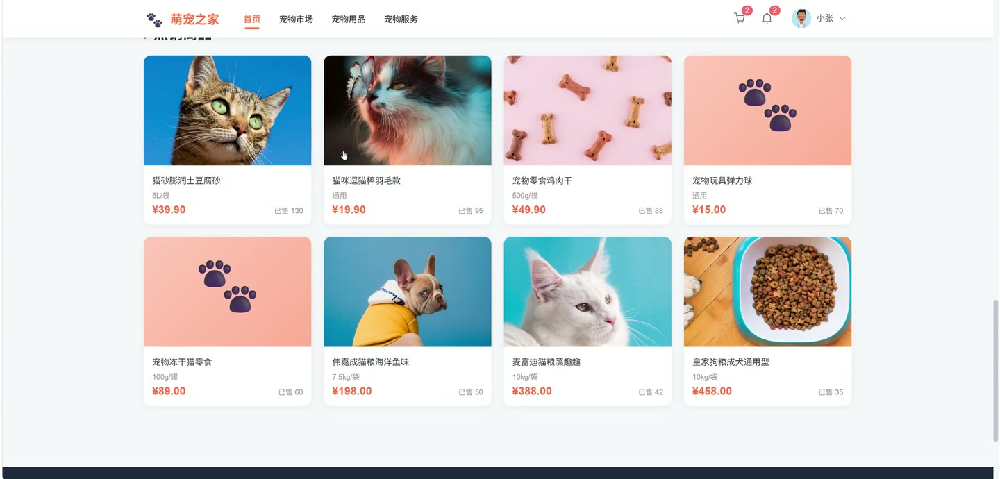
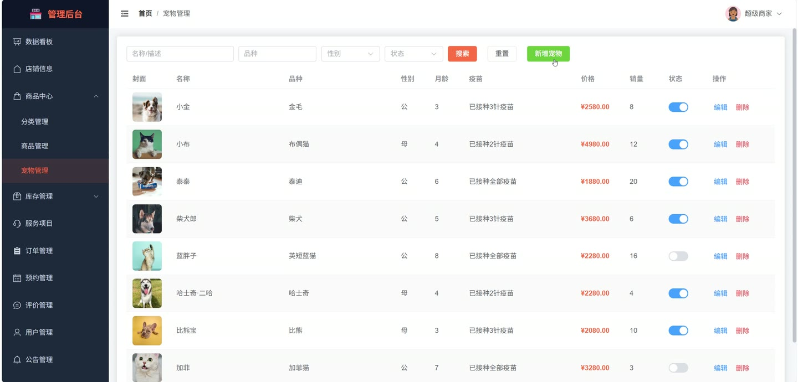
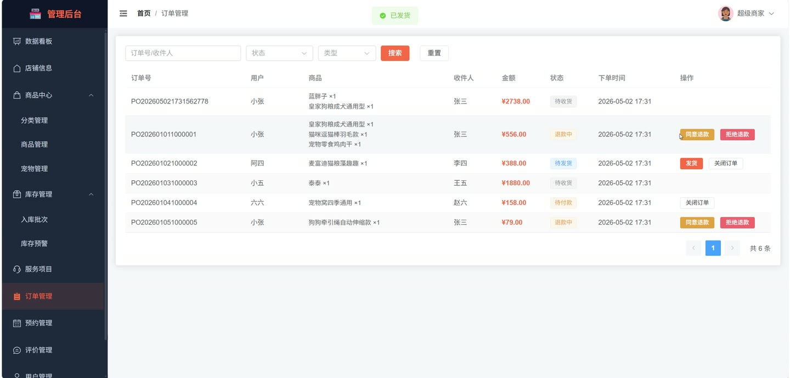
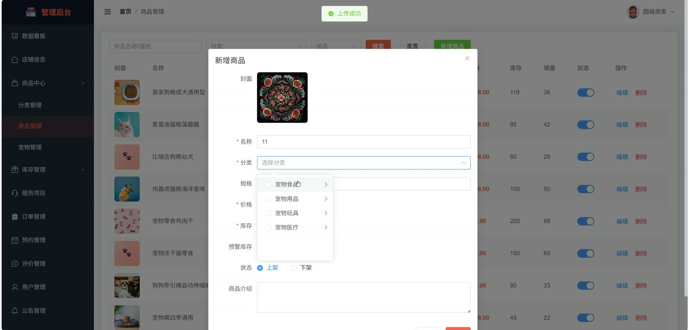
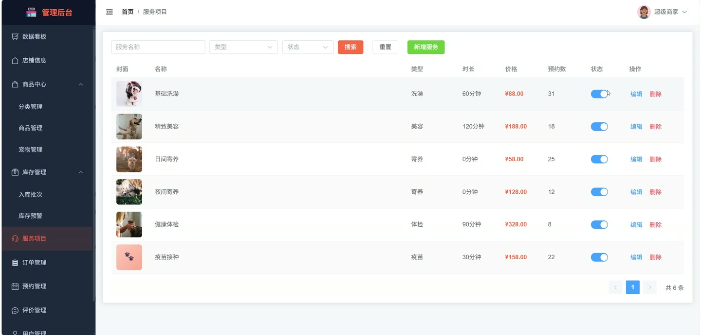

# (附文档)Springboot3+Vue3+MySQL 宠物商店系统

**技术栈**：Springboot3、Vue3、MySQL

### 系统简介

Springboot3+Vue3+MySQL 宠物商店系统是一套基于前后端分离架构的电商平台，支持普通用户与管理员两种角色。系统涵盖商品浏览、宠物展示、服务预约、购物车、订单管理、库存预警、数据统计等核心业务模块，提供完整的电商闭环管理能力。
 
### 核心功能
 
### 普通用户端

 
- 浏览商品列表（支持关键词搜索、分类筛选、按价格/销量/时间排序） 
- 查看商品详情（包含商品介绍、详情图、规格、库存、用户评价） 
- 浏览宠物列表（支持品种/性别筛选，仅展示上架宠物） 
- 查看宠物详情（展示品种、性别、月龄、疫苗情况、价格） 
- 查看服务项目列表（支持按服务类型筛选，如洗澡/美容/寄养） 
- 查看服务项目详情（展示服务名称、类型、时长、价格、描述） 
- 将商品/宠物加入购物车（自动校验库存，重复加入时累加数量） 
- 管理购物车（修改数量、勾选/取消勾选、全选/全不选、删除） 
- 从购物车提交订单（选择收货地址，生成订单并扣减库存） 
- 查看我的订单列表（按订单状态筛选：待付款/待发货/待收货/已完成/已取消/退款中） 
- 订单支付（模拟支付，更新订单状态为待发货） 
- 取消订单（填写取消原因） 
- 申请退款（填写退款原因） 
- 确认收货（更新订单状态为已完成） 
- 创建服务预约（选择服务项目、填写宠物信息、预约时间、联系电话） 
- 查看我的预约列表（按预约状态筛选：待确认/已确认/服务中/已完成/已取消） 
- 取消预约（用户端主动取消） 
- 对已完成的订单/预约发表评价（评分1-5、评价内容、上传图片，同一对象仅能评价一次） 
- 查看我的评价列表 
- 管理收货地址（新增/修改/删除地址，设置默认地址） 
- 查看消息列表（按消息类型筛选：订单/退款/预约/公告/系统） 
- 查看未读消息数量、标记消息已读、全部已读 
- 查看个人资料、修改个人资料（昵称、真实姓名、手机、邮箱、头像、性别） 
- 修改密码（输入原密码、新密码、确认密码） 
- 查看前台公告列表（仅展示已发布的公告）
 
### 管理员端

 
- 登录系统（使用管理员账号密码） 
- 管理商品分类（新增/修改/删除分类，支持树形结构展示父子分类） 
- 管理商品（新增/修改/删除商品，上下架商品，设置分类、规格、库存、预警值、价格、封面图、详情图） 
- 管理宠物（新增/修改/删除宠物，上下架宠物，设置品种、性别、月龄、疫苗情况、价格、封面图） 
- 管理服务项目（新增/修改/删除服务，上下架服务，设置服务类型、时长、价格、封面图） 
- 管理库存批次（新增入库记录，设置批次号、供应商、采购时间、入库数量、成本价，自动更新商品库存） 
- 查看库存预警列表（显示商品名称、当前库存、预警值、处理状态） 
- 刷新库存预警（扫描所有商品库存，自动生成低于预警值的预警记录） 
- 处理库存预警（标记预警为已处理） 
- 修改商品库存预警阈值 
- 管理订单（查看所有订单列表，按关键词/状态/类型筛选） 
- 订单发货（更新订单状态为待收货） 
- 同意退款（更新订单状态为已退款） 
- 拒绝退款（填写拒绝原因） 
- 关闭订单（填写关闭原因） 
- 管理服务预约（查看所有预约列表，按关键词/状态筛选） 
- 确认预约（更新预约状态为已确认） 
- 设置预约状态为服务中/已完成 
- 管理公告（新增/修改/删除公告，设置标题、内容、发布人、发布/下架状态） 
- 管理用户（查看普通用户列表，按关键词搜索，启用/禁用用户账号） 
- 管理评价（查看所有评价列表，按评价对象类型筛选） 
- 编辑店铺信息（店铺名称、LOGO、公告、营业时间、联系方式、地址、描述） 
- 查看数据统计总览（用户数、商品销量、宠物销量、总销售额、预约量） 
- 查看近N日销售额趋势图 
- 查看商品销量Top10排行榜 
- 查看服务预约类型分布饼图 
- 文件上传（支持单文件上传，返回访问路径）
 
### 技术栈

 后端框架Spring Boot 3 ORMMyBatis-Plus 权限认证JWT（Token 认证） 前端框架Vue 3 状态管理Vuex / Pinia 构建工具Vite 数据库MySQL 数据校验Jakarta Validation 工具库Hutool、Lombok
 
### 交付内容

 
- 后端完整源码 
- 前端完整源码 
- 数据库初始化脚本 
- 万字文档

## 界面展示

---

## 获取完整源码 + 万字文档

本仓库为项目介绍页。**完整前后端源码、数据库初始化脚本、万字项目文档**，请加微信 `kangkangcode`，或访问 [codekk.top](http://codekk.top) 获取。

可作课程设计 / 毕业设计参考，支持远程部署调试。